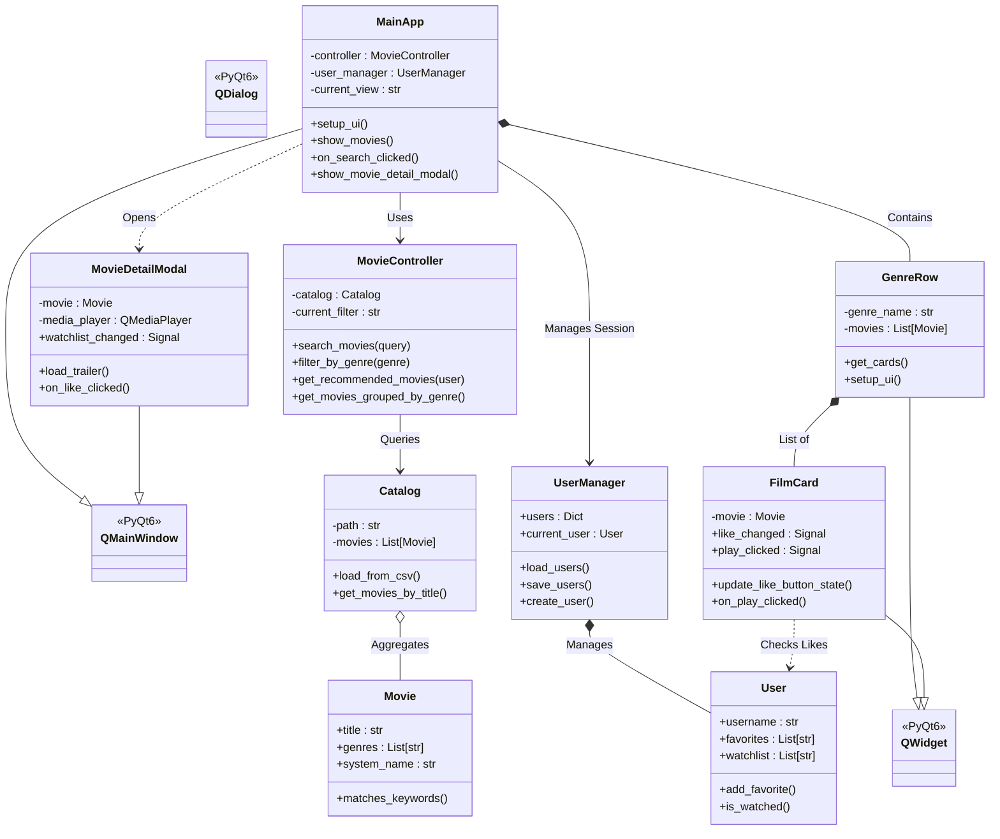
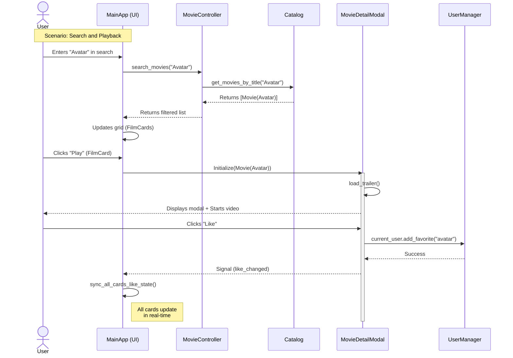
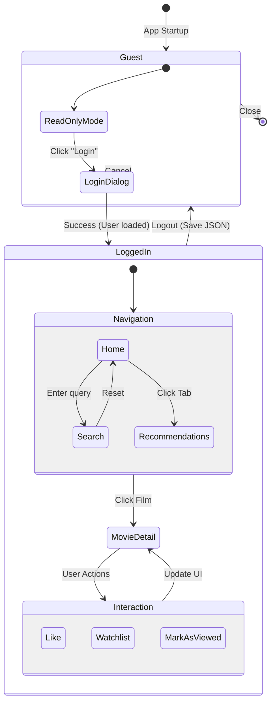
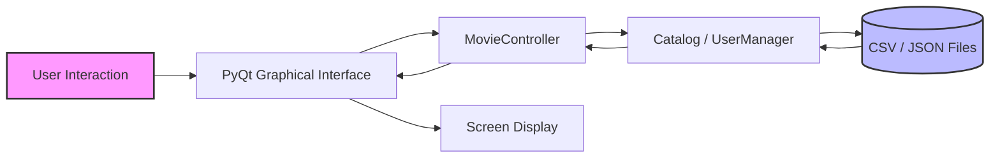

<div align="center">
  

  # NETFLUX
  ### Interactive Movie Recommendation System
  
  [](https://www.python.org/)
  [](https://pypi.org/project/PyQt6/)
  [](LICENSE)
  []()

  <p align="center">
    A modern desktop application mimicking the streaming platform experience,<br>
    with user management, trailer playback, and intelligent recommendations.
  </p>
</div>

---

## 📑 Table of Contents

1. [📖 About the Project](#-about-the-project)
2. [✨ Key Features](#-key-features)
3. [🏗️ Technical Architecture](#️-technical-architecture)
4. [📂 Project Structure](#-project-structure)
5. [💾 Data Management](#-data-management)
6. [🚀 Installation and Setup](#-installation-and-setup)
7. [🎨 Interface & Design](#-interface--design)
8. [👥 The Team](#-the-team)

---

## 📖 About the Project

**Netflux** is a university project developed as part of the *Python Programming (100461-11001)* course. The main objective was to design an interactive movie recommendation system capable of filtering and suggesting content based on user preferences.

Beyond a simple script, we developed a **rich graphical application (GUI)** based on the **MVC (Model-View-Controller)** architecture, offering a smooth user experience close to industry standards (Netflix-style).

### Achievements:
* **Functional recommendation algorithm** based on genres.
* **Advanced Graphical Interface (GUI)** developed with PyQt6.
* **Persistent database** for users (JSON) and movie catalog (CSV).
* **Integrated multimedia playback** for trailers.

---

## ✨ Key Features

### 👤 Complete User Management
* **Authentication:** Secure login and registration system.
* **Persistence:** Automatic saving of user data (preferences, history) in `users.json`.
* **Profiling:** Selection of favorite genres to refine the recommendation algorithm.

### 🎬 Navigation & Discovery
* **Visual Catalog:** Display of movies grouped by categories with smooth horizontal scrolling (`GenreRow` Widget).
* **Advanced Search:** Real-time search bar filtering by title, director, or cast via the `MovieController`.
* **Personalized Recommendations:** Dedicated tab suggesting movies matching the user's favorite genres.

### ❤️ Social Integration & Lists
* **Favorites (Likes):** Add movies to your "Likes". State is synchronized in real-time across the entire interface.
* **Watchlist:** Create your list of movies to watch later.
* **History:** Mark movies as "Watched" to remove them from your queue.

### 📺 Player & Details
* **Detailed Page:** Immersive modal (`MovieDetailModal`) displaying synopsis, year, duration, cast, and director.
* **Video Player:** Integrated playback of trailers (`.mp4`) via `QMediaPlayer`.

---

## 🏗️ Technical Architecture

The project strictly follows the **MVC (Model-View-Controller)** design pattern to ensure maintainability and separation of concerns.

### Detailed Class Diagram


### Sequence Diagram: Search and Playback


### State Diagram: User Navigation


### Data Flow


---

## 📂 Project Structure

Here is the complete source code tree, organized by logical modules:
```
NETFLUX/
├── assets/                  # Static resources (Images, QSS)
│   ├── logo.png
│   └── styles.qss           # Stylesheet (Dark/Purple Theme)
├── controllers/             # Controllers (Business logic)
│   └── movie_controller.py  # Search and filtering management
├── csv_data/                # Static data
│   └── catalog.csv          # Movie database
├── data/                    # Dynamic data (not versioned)
│   ├── movies/              # Video files (.mp4)
│   ├── movies_tiles/        # Movie thumbnails (.jpg)
│   └── users.json           # JSON persistence (déplacé ici)
├── models/                  # Data models
│   ├── catalog.py           # CSV parsing
│   └── movie.py             # Movie object
├── ui/                      # Views (Generated via Qt Designer)
│   └── main_window.py       # Main window
├── user_manager/            # User management
│   └── user.py              # User model (fichier de persistance users.json retiré)
├── widgets/                 # Reusable UI components
│   ├── card.py              # Interactive movie card
│   ├── genre_row.py         # Scrollable movie row
│   └── movie_detail_modal.py # Detail window
└── main.py                  # Application entry point
```

---

## 💾 Data Management

### 1. The Catalog (catalog.csv)

Movies are stored in a structured CSV file loaded by the `Catalog` class.

**Format:** `title:year:minutes:genres:system_name:director:cast:synopsis`

### 2. Users (users.json)

User data persistence is ensured by JSON serialization via `UserManager`.

**Example structure:**
```json
{
  "users": [
    {
      "username": "Alan",
      "favorites": ["evasion", "les_reves_d_anna"],
      "watchlist": ["pirates_des_caraibes"],
      "watched": ["hyperloop"],
      "likedGenres": ["Musical"]
    }
  ],
  "current_user_id": 1764150639486
}
```

---

## 🚀 Installation and Setup

### Prerequisites
- Python 3.8 or higher
- pip (package manager)

### Installation

1. **Clone the repository:**
```bash
git clone https://github.com/your-repo/netflux.git
cd netflux
```

2. **Install dependencies:**

The project requires the PyQt6 library for the graphical interface.
```bash
pip install PyQt6
```

3. **Verify resources:**

Ensure that the `assets/` folder contains `logo.png` and `styles.qss`. To enjoy video features, place your `.mp4` files in `data/movies/`.

4. **Launch the application:**
```bash
python main.py
```

---

## 🎨 Interface & Design

The interface was entirely styled via **QSS (Qt Style Sheets)** to match a strong visual identity ("Dark Mode" & "Purple Accent"), defined in `assets/styles.qss`.

| Element  | Hex Color | Description                        |
|----------|-----------|-------------------------------------|
| Background | #0A0A0A | Deep black (Background)            |
| Primary  | #8B5CF6   | Electric purple (Buttons, Accents) |
| Hover    | #9D6FFF   | Light purple (Hover states)        |
| Text     | #FFFFFF   | Pure white                         |

---

## 👥 The Team

Project developed by the **Netflux** team:

- **[Member Name 1]** - Backend Architecture & Controllers
- **[Member Name 2]** - Graphical Interface & QSS Design
- **[Member Name 3]** - Data Management (CSV/JSON) & Models
- **[Member Name 4]** - Recommendation System & Testing

---

<div align="center">
  <small>Made with ❤️ and ☕ for the Python Programming course - 2025</small>
</div>
