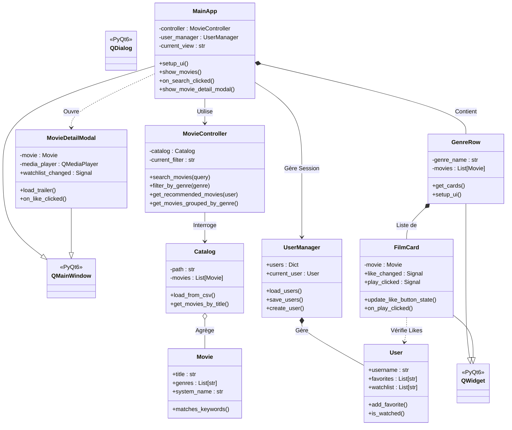
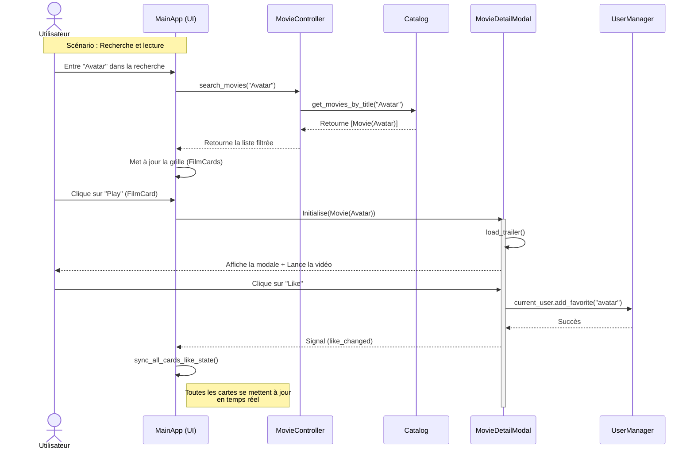
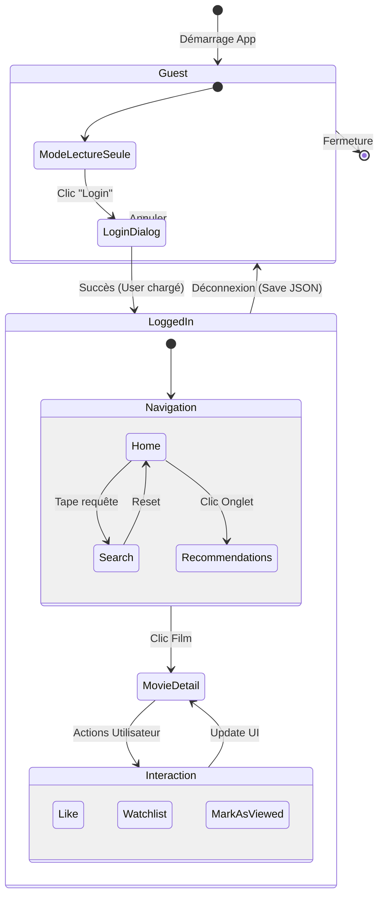
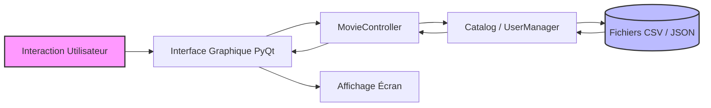

<div align="center">
  

  # NETFLUX
  ### Système de Recommandation de Films Interactif
  
  [](https://www.python.org/)
  [](https://pypi.org/project/PyQt6/)
  [](LICENSE)
  []()

  <p align="center">
    Une application de bureau moderne mimant l'expérience des plateformes de streaming,<br>
    avec gestion utilisateur, lecture de bandes-annonces et recommandations intelligentes.
  </p>
</div>

---

## 📑 Table des Matières

1. [📖 À propos du Projet](#-à-propos-du-projet)
2. [✨ Fonctionnalités Clés](#-fonctionnalités-clés)
3. [🏗️ Architecture Technique](#️-architecture-technique)
4. [📂 Structure du Projet](#-structure-du-projet)
5. [💾 Gestion des Données](#-gestion-des-données)
6. [🚀 Installation et Démarrage](#-installation-et-démarrage)
7. [🎨 Interface & Design](#-interface--design)
8. [👥 L'Équipe](#-léquipe)

---

## 📖 À propos du Projet

**Netflux** est un projet universitaire réalisé dans le cadre du cours *Python Programming (100461-11001)*. L'objectif principal était de concevoir un système de recommandation de films interactif capable de filtrer et suggérer des contenus selon les préférences des utilisateurs.

Au-delà d'un simple script, nous avons développé une **application graphique riche (GUI)** basée sur l'architecture **MVC (Modèle-Vue-Contrôleur)**, offrant une expérience utilisateur fluide proche des standards de l'industrie (type Netflix).

### Objectifs atteints :
* **Algorithme de recommandation** fonctionnel basé sur les genres.
* **Interface Graphique (GUI)** avancée développée avec PyQt6.
* **Base de données** persistante pour les utilisateurs (JSON) et catalogue de films (CSV).
* **Lecture multimédia** intégrée pour les bandes-annonces.

---

## ✨ Fonctionnalités Clés

### 👤 Gestion Utilisateur Complète
* **Authentification :** Système de connexion et d'inscription sécurisé.
* **Persistance :** Sauvegarde automatique des données utilisateurs (préférences, historique) dans `users.json`.
* **Profilage :** Sélection des genres préférés pour affiner l'algorithme de recommandation.

### 🎬 Navigation & Découverte
* **Catalogue Visuel :** Affichage des films groupés par catégories avec défilement horizontal fluide (Widget `GenreRow`).
* **Recherche Avancée :** Barre de recherche en temps réel filtrant par titre, réalisateur ou casting via le `MovieController`.
* **Recommandations Personnalisées :** Onglet dédié proposant des films correspondant aux genres aimés par l'utilisateur.

### ❤️ Intégration Sociale & Listes
* **Favoris (Likes) :** Ajoutez des films à vos "Likes". L'état est synchronisé en temps réel sur toute l'interface.
* **Watchlist :** Créez votre liste de films à voir plus tard.
* **Historique :** Marquez les films comme "Vus" pour les retirer de votre liste d'attente.

### 📺 Lecteur & Détails
* **Fiche Détaillée :** Modale immersive (`MovieDetailModal`) affichant synopsis, année, durée, casting et réalisateur.
* **Lecteur Vidéo :** Lecture intégrée des bandes-annonces (`.mp4`) via `QMediaPlayer`.

---

## 🏗️ Architecture Technique

Le projet respecte strictement le patron de conception **MVC (Model-View-Controller)** pour assurer la maintenabilité et la séparation des responsabilités.

### Diagramme de Classes Détaillé


### Diagramme de Séquence : Recherche et Lecture


### Diagramme d'États : Navigation Utilisateur


### Flux de Données (Data Flow)


---

## 📂 Structure du Projet

Voici l'arborescence complète du code source, organisée par modules logiques :
```
NETFLUX/
├── assets/                  # Ressources statiques (Images, QSS)
│   ├── logo.png
│   └── styles.qss           # Feuille de style (Thème Dark/Purple)
├── controllers/             # Contrôleurs (Logique métier)
│   └── movie_controller.py  # Gestion recherche et filtrage
├── csv_data/                # Données statiques
│   └── catalog.csv          # Base de données des films
├── data/                    # Données dynamiques (non versionnées)
│   ├── movies/              # Fichiers vidéos (.mp4)
│   └── movies_tiles/        # Miniatures des films (.jpg)
├── models/                  # Modèles de données
│   ├── catalog.py           # Parsing CSV
│   └── movie.py             # Objet Movie
├── ui/                      # Vues (Générées via Qt Designer)
│   └── main_window.py       # Fenêtre principale
├── user_manager/            # Gestion des utilisateurs
│   ├── user.py              # Modèle User
│   └── users.json           # Persistance JSON
├── widgets/                 # Composants UI réutilisables
│   ├── card.py              # Carte de film interactive
│   ├── genre_row.py         # Rangée de films défilante
│   └── movie_detail_modal.py # Fenêtre de détails
└── main.py                  # Point d'entrée de l'application
```

---

## 💾 Gestion des Données

### 1. Le Catalogue (catalog.csv)

Les films sont stockés dans un fichier CSV structuré chargé par la classe `Catalog`.

**Format :** `title:year:minutes:genres:system_name:director:cast:synopsis`

### 2. Les Utilisateurs (users.json)

La persistance des données utilisateurs est assurée par sérialisation JSON via `UserManager`.

**Exemple de structure :**
```json
{
  "users": [
    {
      "username": "Alan",
      "favorites": ["evasion", "les_reves_d_anna"],
      "watchlist": ["pirates_des_caraibes"],
      "watched": ["hyperloop"],
      "likedGenres": ["Musical"]
    }
  ],
  "current_user_id": 1764150639486
}
```

---

## 🚀 Installation et Démarrage

### Prérequis
- Python 3.8 ou supérieur
- pip (gestionnaire de paquets)

### Installation

1. **Cloner le dépôt :**
```bash
git clone https://github.com/votre-repo/netflux.git
cd netflux
```

2. **Installer les dépendances :**

Le projet nécessite la librairie PyQt6 pour l'interface graphique.
```bash
pip install PyQt6
```

3. **Vérifier les ressources :**

Assurez-vous que le dossier `assets/` contient bien `logo.png` et `styles.qss`. Pour profiter des fonctionnalités vidéo, placez vos fichiers `.mp4` dans `data/movies/`.

4. **Lancer l'application :**
```bash
python main.py
```

---

## 🎨 Interface & Design

L'interface a été entièrement stylisée via **QSS (Qt Style Sheets)** pour correspondre à une identité visuelle forte ("Dark Mode" & "Purple Accent"), définie dans `assets/styles.qss`.

| Élément  | Couleur Hex | Description                        |
|----------|-------------|------------------------------------|
| Fond     | #0A0A0A     | Noir profond (Background)          |
| Primaire | #8B5CF6     | Violet électrique (Boutons, Accents) |
| Survol   | #9D6FFF     | Violet clair (Hover states)        |
| Texte    | #FFFFFF     | Blanc pur                          |

---

## 👥 L'Équipe

Projet réalisé par l'équipe **Netflux** :

- **[Nom Membre 1]** - Architecture Backend & Contrôleurs
- **[Nom Membre 2]** - Interface Graphique & Design QSS
- **[Nom Membre 3]** - Gestion des Données (CSV/JSON) & Modèles
- **[Nom Membre 4]** - Système de Recommandation & Tests

---

<div align="center">
  <small>Réalisé avec ❤️ et du ☕ pour le cours Python Programming - 2025</small>
</div>
